# TFT_RAG_DISECAN

Trabajo de Fin de Título pensado para realizar una arquitectura RAG sobre documentos del parlamento canario a gran escala.

## Architecture & Entity-Relationship Modeling

### System Architecture


### Data Modeling & Context Layer


---

## Usage Guide

Welcome to the **DiSeCan LLM** project! This repository contains a Retrieval-Augmented Generation (RAG) architecture built to query large-scale parliamentary documents from the Canary Islands. 

Currently, the project features a responsive web frontend (HTML/CSS/JS) served by a Flask backend REST API, ready to be connected to the core LlamaIndex/RAG pipeline.

### Prerequisites

To run this project, make sure you have installed on your system:
- **Python 3.11** or higher.
- [**uv**](https://github.com/astral-sh/uv) (Extremely fast Python package installer and resolver).

### Installation

1. Clone the repository and navigate to the project directory:
   ```bash
   cd TFT_RAG_DISECAN
   ```

2. Install the necessary dependencies using `uv`. This will automatically install requirements like Flask and Flask-CORS as defined in `pyproject.toml`:
   ```bash
   uv sync
   ```

### Running the Application

To start the backend server and serve the user interface:

1. Execute the main entry point:
   ```bash
   uv run python src/main.py
   ```

2. Once the server is running, the terminal will indicate that Flask is active.
3. Open your web browser and navigate to:
   **[http://127.0.0.1:5000](http://127.0.0.1:5000)**

4. *Optional*: For development purposes, you can resize your browser window to test the responsive mobile view (under `768px` width), which swaps the fixed sidebar for a mobile-friendly slide-out menu.

### Project Structure Overview

- `src/main.py`: Entry point for the application. Starts the Flask server.
- `src/backend/app.py`: Flask REST API serving endpoints for the chat interface and the static frontend files.
- `src/frontend/`: Contains the vanilla HTML, CSS, and JavaScript files rendering the UI.
- `docs/design/`: Diagrams and mockups of the proposed architecture.


## database/init/

Esta carpeta contiene los scripts SQL que MySQL ejecuta **automáticamente**
la primera vez que se levanta el contenedor (cuando el volumen está vacío).

## Cómo cargar el dump

1. Copia el archivo `DumpDiSeCan.sql` (el dump de 1 GB) a esta carpeta:

   ```
   database/
   └── init/
       └── DumpDiSeCan.sql   ← aquí
   ```

2. Levanta el contenedor:

   ```bash
   docker compose up -d
   ```

3. La primera vez tardará varios minutos (importación del dump).
   Puedes ver el progreso con:

   ```bash
   docker logs -f disecan-mysql
   ```

4. Cuando veas `ready for connections` en los logs, la BD está lista.

## Notas

- Los archivos `.sql` en esta carpeta se ejecutan **en orden alfabético**.  
  Si necesitas cargar primero la estructura y luego los datos, nómbralos:
  - `01_estructura.sql`
  - `02_datos.sql`

- Los dumps `.sql.gz` también son soportados directamente por MySQL Docker.
  Si comprimes el dump, puedes ahorrarte espacio significativo:

  ```bash
  gzip DumpDiSeCan.sql   # genera DumpDiSeCan.sql.gz (~100-200 MB)
  ```

- Esta carpeta está en `.gitignore` para evitar subir el dump al repositorio.
