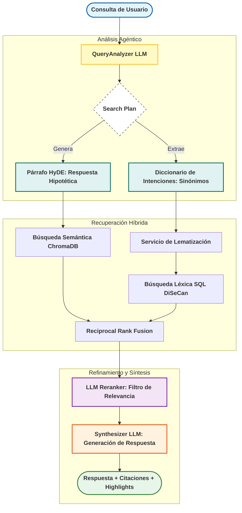

# Flujo de RAG Agéntico DiSeCan

Este diagrama representa la arquitectura actual del sistema, integrando las técnicas de **HyDE**, **Expansión Léxica** y **Re-rankeo Contextual**.

## Componentes Clave

- **HyDE (Hypothetical Document Embeddings)**: Convierte una pregunta abstracta en un párrafo que "suena" como una intervención parlamentaria, mejorando drásticamente el matching semántico.
- **Expansión Léxica**: El LLM actúa como traductor de lenguaje natural a lenguaje técnico parlamentario (ej: de "barato" a "flete", "carestía", "subvención").
- **Re-rankeo LLM**: Una vez recuperados los fragmentos, un modelo pequeño (Qwen 3B) evalúa la relevancia real de cada uno antes de mostrarlos al usuario, reduciendo el ruido.
