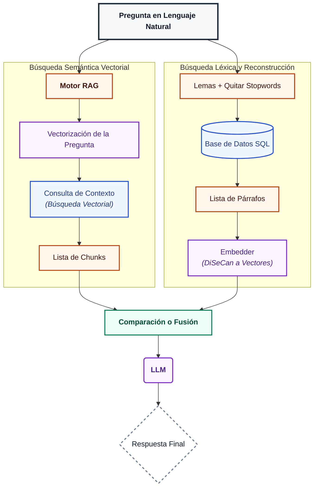

```mermaid
graph TD
    %% ----- ESTILOS PREMIUM -----
    classDef quest fill:#f8fafc,stroke:#1e293b,stroke-width:3px,color:#0f172a,font-size:16px;
    classDef process fill:#fff7ed,stroke:#c2410c,stroke-width:2px,color:#431407;
    classDef db fill:#eff6ff,stroke:#1d4ed8,stroke-width:2px,color:#1e3a8a;
    classDef ai fill:#faf5ff,stroke:#7e22ce,stroke-width:2px,color:#4c1d95;
    classDef fusion fill:#ecfdf5,stroke:#047857,stroke-width:2px,color:#064e3b;
    classDef output fill:#ffffff,stroke:#64748b,stroke-width:2px,stroke-dasharray: 5 5,color:#0f172a;

    %% ----- INICIO -----
    START["<b>Pregunta en Lenguaje Natural</b>"]:::quest

    %% ----- CAMINO 1: RAG TRADICIONAL -----
    START --> BUSQ_RAG["<b>Motor RAG</b>"]:::process
    BUSQ_RAG --> VEC_PREG[Vectorización de la Pregunta]:::ai
    VEC_PREG --> CONS_CTX["Consulta de Contexto <br/><i>(Búsqueda Vectorial)</i>"]:::db
    CONS_CTX --> LIST_CHUNKS[Lista de Chunks]:::process

    %% ----- CAMINO 2: DISECAN + SQL -----
    START --> PROC_LEMAS[Lemas + Quitar Stopwords]:::process
    PROC_LEMAS --> SQL_DB[(Base de Datos SQL)]:::db
    SQL_DB --> LIST_PARRAFOS[Lista de Párrafos]:::process
    LIST_PARRAFOS --> EMB_DIS["Embedder <br/><i>(DiSeCan a Vectores)</i>"]:::ai

    %% ----- CONFLUENCIA Y GENERACIÓN -----
    LIST_CHUNKS --> FUSION["<b>Comparación o Fusión</b>"]:::fusion
    EMB_DIS --> FUSION

    FUSION --> LLM("<b>LLM</b>"):::ai
    LLM --> RESP{Respuesta Final}:::output

    %% Notas de flujo
    subgraph Rama_RAG [Búsqueda Semántica Vectorial]
        BUSQ_RAG
        VEC_PREG
        CONS_CTX
        LIST_CHUNKS
    end

    subgraph Rama_DISECAN [Búsqueda Léxica y Reconstrucción]
        PROC_LEMAS
        SQL_DB
        LIST_PARRAFOS
        EMB_DIS
    end
```