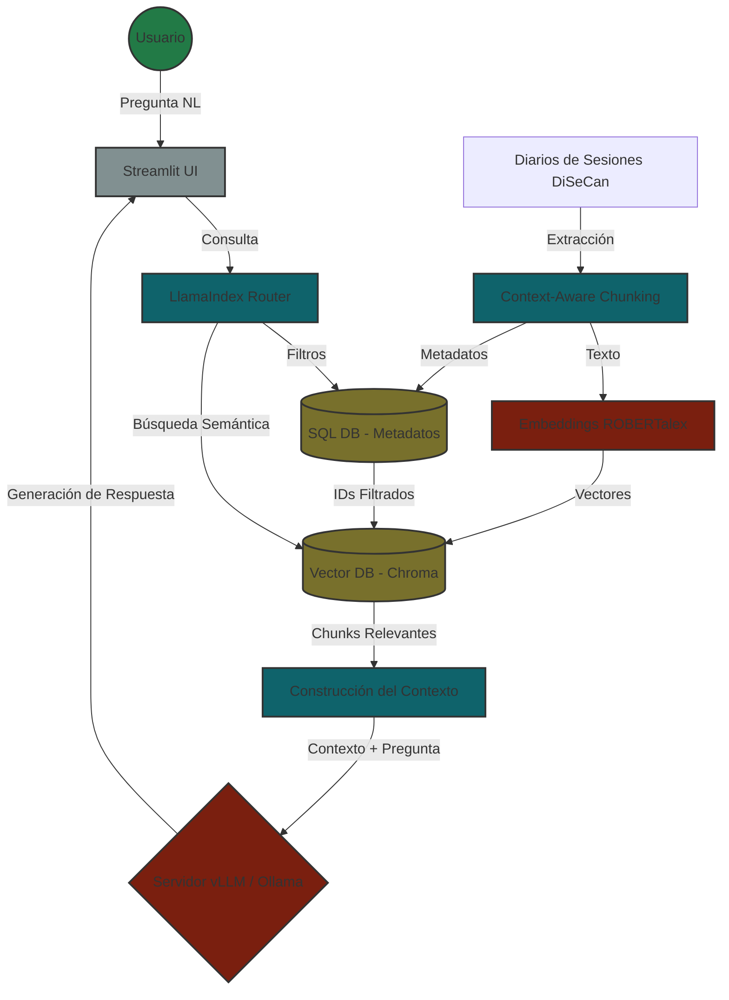

```mermaid
graph TD
    %% Definición de Estilos
    classDef usuario fill:#227a46,stroke:#333,stroke-width:2px;
    classDef frontend fill:#819091,stroke:#333,stroke-width:2px;
    classDef orquestador fill:#0f636b,stroke:#333,stroke-width:2px;
    classDef bd fill:#78702c,stroke:#333,stroke-width:2px;
    classDef llm fill:#7a1f0f,stroke:#333,stroke-width:2px;

    %% Flujo del Usuario (Online)
    User((Usuario)):::usuario -->|Pregunta NL| UI[Streamlit UI]:::frontend
    UI -->|Consulta| LlamaIndex[LlamaIndex Router]:::orquestador
    
    %% Recuperación Híbrida
    LlamaIndex -->|Filtros| SQLDB[(SQL DB - Metadatos)]:::bd
    LlamaIndex -->|Búsqueda Semántica| VecDB[(Vector DB - Chroma)]:::bd
    SQLDB -->|IDs Filtrados| VecDB
    VecDB -->|Chunks Relevantes| Prompt[Construcción del Contexto]:::orquestador
    
    %% Generación
    Prompt -->|Contexto + Pregunta| vLLM{Servidor vLLM / Ollama}:::llm
    vLLM -->|Generación de Respuesta| UI
    
    %% Flujo de Ingesta (Offline)
    Actas[Diarios de Sesiones DiSeCan] -->|Extracción| Chunking[Context-Aware Chunking]:::orquestador
    Chunking -->|Texto| Embeddings[Embeddings ROBERTalex]:::llm
    Chunking -->|Metadatos| SQLDB
    Embeddings -->|Vectores| VecDB
```