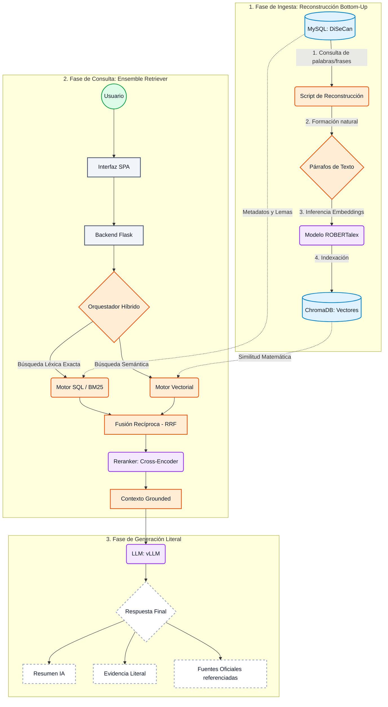

```mermaid
graph TD
    %% ----- ESTILOS -----
    classDef database fill:#e0f2fe,stroke:#0284c7,stroke-width:2px,color:#0f172a;
    classDef process fill:#ffedd5,stroke:#ea580c,stroke-width:2px,color:#0f172a;
    classDef ai fill:#f3e8ff,stroke:#9333ea,stroke-width:2px,color:#0f172a;
    classDef user fill:#dcfce7,stroke:#16a34a,stroke-width:2px,color:#0f172a;
    classDef interface fill:#f1f5f9,stroke:#475569,stroke-width:2px,color:#0f172a;
    classDef output fill:#ffffff,stroke:#94a3b8,stroke-width:2px,stroke-dasharray: 5 5,color:#0f172a;

    %% ----- INGESTA -----
    subgraph Ingesta [1. Fase de Ingesta: Reconstrucción Bottom-Up]
        DB_SQL[(MySQL: DiSeCan)]:::database -- "1. Consulta de palabras/frases" --> RECON(Script de Reconstrucción):::process
        RECON -- "2. Formación natural" --> CHUNKS{Párrafos de Texto}:::process
        CHUNKS -- "3. Inferencia Embeddings" --> EMB(Modelo ROBERTalex):::ai
        EMB -- "4. Indexación" --> VDB[(ChromaDB: Vectores)]:::database
    end

    %% ----- CONSULTA -----
    subgraph Consulta [2. Fase de Consulta: Ensemble Retriever]
        USER((Usuario)):::user --> UI[Interfaz SPA]:::interface
        UI --> API[Backend Flask]:::interface
        API --> ORQ{Orquestador Híbrido}:::process

        %% Ramas paralelas
        ORQ -- "Búsqueda Léxica Exacta" --> BUS_LEX(Motor SQL / BM25):::process
        ORQ -- "Búsqueda Semántica" --> BUS_SEM(Motor Vectorial):::process

        BUS_LEX --> JOIN[Fusión Recíproca - RRF]:::process
        BUS_SEM --> JOIN

        JOIN --> RANK(Reranker: Cross-Encoder):::ai
        RANK --> CTX[Contexto Grounded]:::process
    end

    %% ----- GENERACIÓN -----
    subgraph Generacion [3. Fase de Generación Literal]
        CTX --> LLM(LLM: vLLM):::ai
        LLM --> RESP{Respuesta Final}:::output
        RESP --> RES_IA[Resumen IA]:::output
        RESP --> RES_LIT[Evidencia Literal]:::output
        RESP --> RES_REF[Fuentes Oficiales referenciadas]:::output
    end

    %% ----- ENLACES ENTRE FLUJOS -----
    DB_SQL -.-> |"Metadatos y Lemas"| BUS_LEX
    VDB -.-> |"Similitud Matemática"| BUS_SEM
```