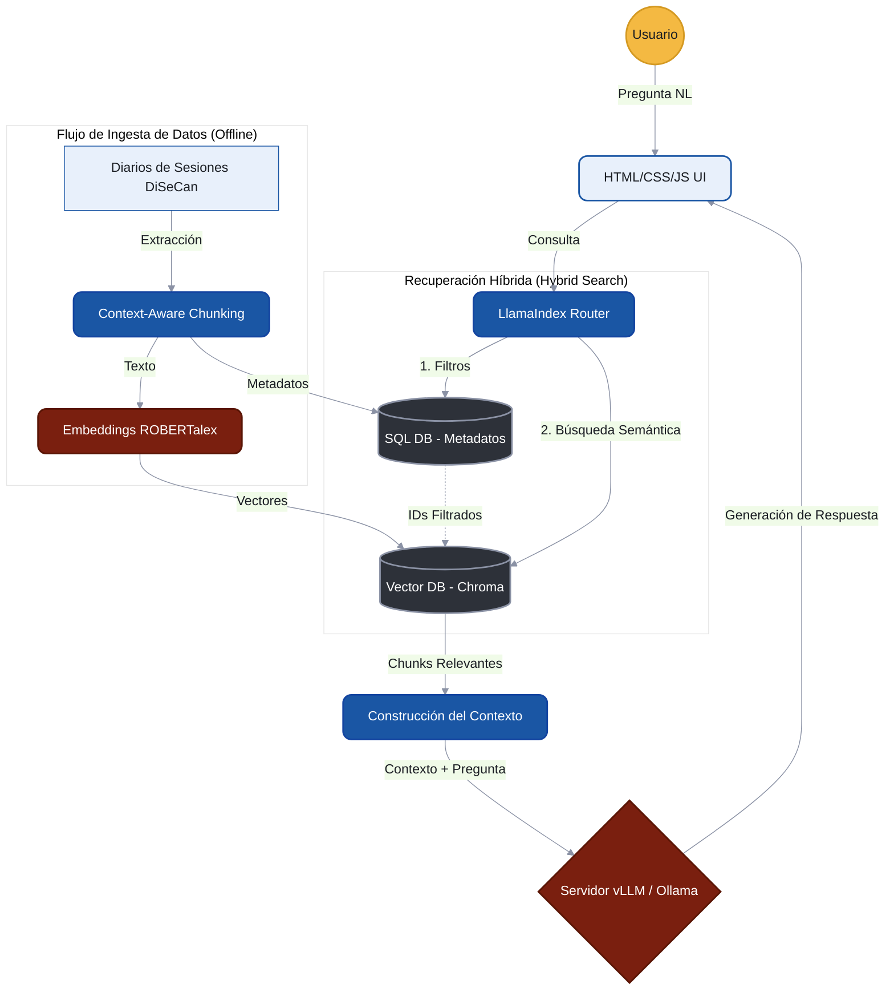

```mermaid
%%{
  init: {
    'theme': 'base',
    'themeVariables': {
      'primaryColor': '#e8f0fb',
      'primaryTextColor': '#1a1d23',
      'primaryBorderColor': '#1a56a4',
      'lineColor': '#8b92a5',
      'tertiaryColor': '#fff'
    }
  }
}%%
graph TD
    classDef usuario fill:#f4b942,stroke:#d49922,stroke-width:2px,color:#1a1d23,rx:50,ry:50;
    classDef frontend fill:#e8f0fb,stroke:#1a56a4,stroke-width:2px,color:#1a1d23,rx:10,ry:10;
    classDef orquestador fill:#1a56a4,stroke:#1344a0,stroke-width:2px,color:#fff,rx:10,ry:10;
    classDef bd fill:#2d3139,stroke:#8b92a5,stroke-width:2px,color:#fff,rx:10,ry:10;
    classDef llm fill:#7a1f0f,stroke:#5a1505,stroke-width:2px,color:#fff,rx:10,ry:10;

    %% Flujo del Usuario (Online)
    User((Usuario)):::usuario -->|Pregunta NL| UI[HTML/CSS/JS UI]:::frontend
    UI -->|Consulta| LlamaIndex[LlamaIndex Router]:::orquestador
    
    %% Recuperación Híbrida
    subgraph Recuperación["Recuperación Híbrida (Hybrid Search)"]
        LlamaIndex -->|1. Filtros| SQLDB[(SQL DB - Metadatos)]:::bd
        LlamaIndex -->|2. Búsqueda Semántica| VecDB[(Vector DB - Chroma)]:::bd
        SQLDB -.->|IDs Filtrados| VecDB
    end

    VecDB -->|Chunks Relevantes| Prompt[Construcción del Contexto]:::orquestador
    
    %% Generación
    Prompt -->|Contexto + Pregunta| vLLM{Servidor vLLM / Ollama}:::llm
    vLLM -->|Generación de Respuesta| UI
    
    %% Flujo de Ingesta (Offline)
    subgraph Ingesta["Flujo de Ingesta de Datos (Offline)"]
        Actas[Diarios de Sesiones DiSeCan] -->|Extracción| Chunking[Context-Aware Chunking]:::orquestador
        Chunking -->|Texto| Embeddings[Embeddings ROBERTalex]:::llm
        Chunking -->|Metadatos| SQLDB
        Embeddings -->|Vectores| VecDB
    end
```