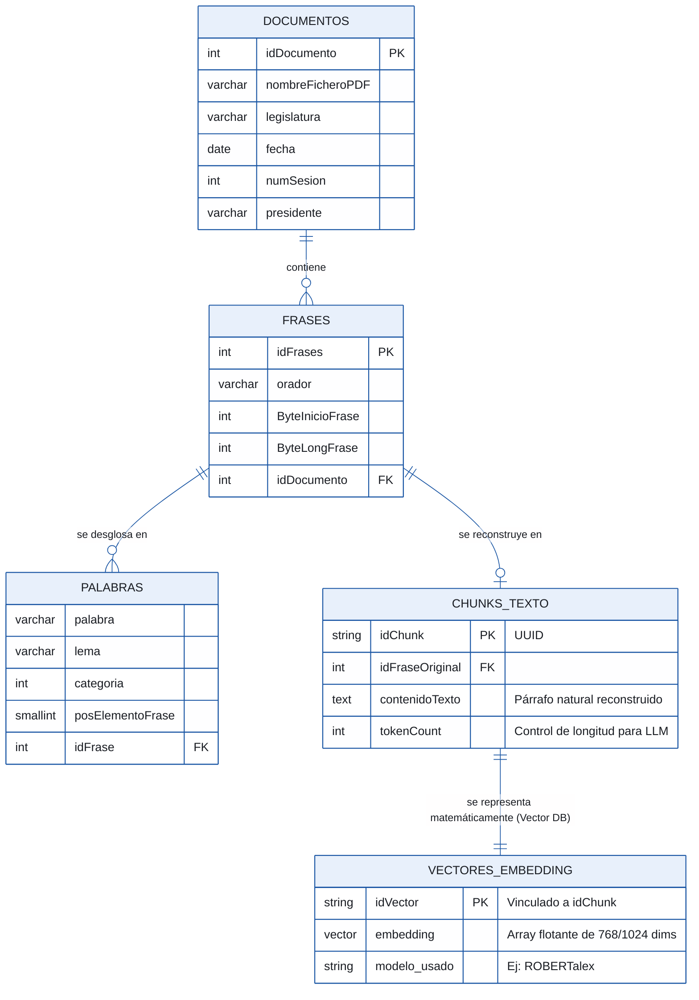

```mermaid
%%{
  init: {
    'theme': 'base',
    'themeVariables': {
      'primaryColor': '#e8f0fb',
      'primaryBorderColor': '#1a56a4',
      'primaryTextColor': '#1a1d23',
      'lineColor': '#1a56a4'
    }
  }
}%%
erDiagram
    %% BLOQUE 1: METADATOS HEREDADOS (DiSeCan / IATEXT)
    DOCUMENTOS {
        int idDocumento PK
        varchar nombreFicheroPDF
        varchar legislatura
        date fecha
        int numSesion
        varchar presidente
    }

    FRASES {
        int idFrases PK
        varchar orador
        int ByteInicioFrase
        int ByteLongFrase
        int idDocumento FK
    }

    PALABRAS {
        varchar palabra
        varchar lema
        int categoria
        smallint posElementoFrase
        int idFrase FK
    }

    %% BLOQUE 2: NUEVA CAPA DE CONTEXTO Y RAG (Tu aportación)
    CHUNKS_TEXTO {
        string idChunk PK "UUID"
        int idFraseOriginal FK
        text contenidoTexto "Párrafo natural reconstruido"
        int tokenCount "Control de longitud para LLM"
    }

    VECTORES_EMBEDDING {
        string idVector PK "Vinculado a idChunk"
        vector embedding "Array flotante de 768/1024 dims"
        string modelo_usado "Ej: ROBERTalex"
    }

    %% RELACIONES
    DOCUMENTOS ||--o{ FRASES : "contiene"
    FRASES ||--o{ PALABRAS : "se desglosa en"
    
    %% El puente entre el mundo relacional y el semántico
    FRASES ||--o| CHUNKS_TEXTO : "se reconstruye en"
    CHUNKS_TEXTO ||--|| VECTORES_EMBEDDING : "se representa matemáticamente (Vector DB)"
```