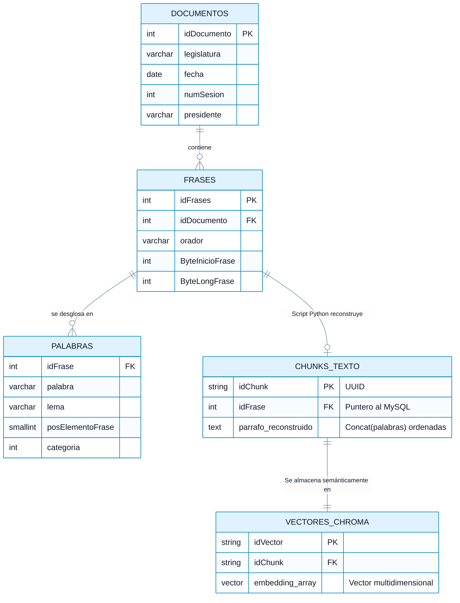

```mermaid
%%{
  init: {
    'theme': 'base',
    'themeVariables': {
      'primaryColor': '#e0f2fe',
      'primaryBorderColor': '#0284c7',
      'primaryTextColor': '#0f172a',
      'lineColor': '#64748b',
      'attributeBackgroundColorEven': '#f0f9ff',
      'attributeBackgroundColorOdd': '#ffffff',
      'fontSize': '18px'
    }
  }
}%%
erDiagram
    %% BLOQUE 1: BASE DE DATOS FÍSICA (MySQL DiSeCan)
    DOCUMENTOS {
        int idDocumento PK
        varchar legislatura
        date fecha
        int numSesion
        varchar presidente
    }

    FRASES {
        int idFrases PK
        int idDocumento FK
        varchar orador
        int ByteInicioFrase
        int ByteLongFrase
    }

    PALABRAS {
        int idFrase FK
        varchar palabra
        varchar lema
        smallint posElementoFrase
        int categoria
    }

    %% BLOQUE 2: ECOSISTEMA RAG (Lógico y ChromaDB)
    CHUNKS_TEXTO {
        string idChunk PK "UUID"
        int idFrase FK "Puntero al MySQL"
        text parrafo_reconstruido "Concat(palabras) ordenadas"
    }

    VECTORES_CHROMA {
        string idVector PK
        string idChunk FK
        vector embedding_array "Vector multidimensional"
    }

    %% RELACIONES DEL ESQUEMA
    DOCUMENTOS ||--o{ FRASES : "contiene"
    FRASES ||--o{ PALABRAS : "se desglosa en"
    
    %% PUENTE ENTRE MYSQL Y RAG
    FRASES ||--o| CHUNKS_TEXTO : "Script Python reconstruye"
    CHUNKS_TEXTO ||--|| VECTORES_CHROMA : "Se almacena semánticamente en"
```