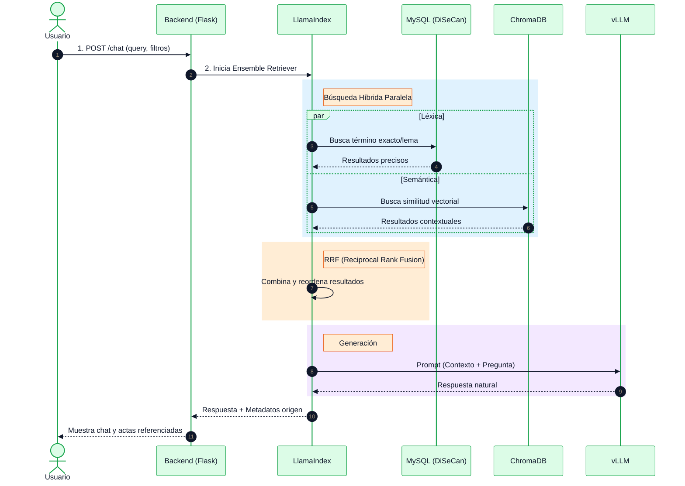

```mermaid
%%{
  init: {
    'theme': 'base',
    'themeVariables': {
      'primaryColor': '#ffffff',
      'primaryBorderColor': '#94a3b8',
      'primaryTextColor': '#0f172a',
      'lineColor': '#64748b',
      'actorBkg': '#dcfce7',
      'actorBorder': '#16a34a',
      'noteBkgColor': '#ffedd5',
      'noteBorderColor': '#ea580c',
      'noteTextColor': '#0f172a',
      'messageTextColor': '#0f172a',
      'fontSize': '20px',
      'actorFontSize': '22px',
      'noteFontSize': '18px',
      'messageFontSize': '18px'
    }
  }
}%%
sequenceDiagram
    autonumber
    actor U as Usuario
    participant API as Backend (Flask)
    participant LI as LlamaIndex
    participant SQL as MySQL (DiSeCan)
    participant VDB as ChromaDB
    participant LLM as vLLM

    U->>API: 1. POST /chat (query, filtros)
    API->>LI: 2. Inicia Ensemble Retriever
    
    rect rgb(224, 242, 254)
        Note right of LI: Búsqueda Híbrida Paralela
        par Léxica
            LI->>SQL: Busca término exacto/lema
            SQL-->>LI: Resultados precisos
        and Semántica
            LI->>VDB: Busca similitud vectorial
            VDB-->>LI: Resultados contextuales
        end
    end

    rect rgb(255, 237, 213)
        Note right of LI: RRF (Reciprocal Rank Fusion)
        LI->>LI: Combina y reordena resultados
    end

    rect rgb(243, 232, 255)
        Note right of LI: Generación
        LI->>LLM: Prompt (Contexto + Pregunta)
        LLM-->>LI: Respuesta natural
    end

    LI-->>API: Respuesta + Metadatos origen
    API-->>U: Muestra chat y actas referenciadas
```