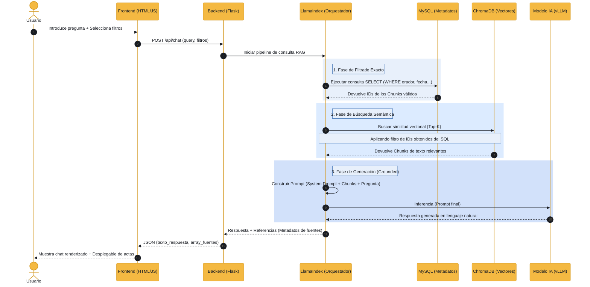

```mermaid
%%{
  init: {
    'theme': 'base',
    'themeVariables': {
      'primaryColor': '#1a56a4',
      'primaryTextColor': '#fff',
      'primaryBorderColor': '#1344a0',
      'lineColor': '#8b92a5',
      'actorBkg': '#f4b942',
      'actorBorder': '#d49922',
      'actorTextColor': '#1a1d23',
      'noteBkgColor': '#e8f0fb',
      'noteBorderColor': '#1a56a4',
      'noteTextColor': '#1a1d23',
      'messageTextColor': '#1a1d23',
      'textColor': '#1a1d23'
    }
  }
}%%
sequenceDiagram
    autonumber
    actor U as Usuario
    participant UI as Frontend (HTML/JS)
    participant API as Backend (Flask)
    participant LI as LlamaIndex (Orquestador)
    participant SQL as MySQL (Metadatos)
    participant VDB as ChromaDB (Vectores)
    participant LLM as Modelo IA (vLLM)

    U->>UI: Introduce pregunta + Selecciona filtros
    UI->>API: POST /api/chat (query, filtros)
    API->>LI: Iniciar pipeline de consulta RAG
    
    rect rgb(232, 240, 251)
        Note right of LI: 1. Fase de Filtrado Exacto
        LI->>SQL: Ejecutar consulta SELECT (WHERE orador, fecha...)
        SQL-->>LI: Devuelve IDs de los Chunks válidos
    end

    rect rgb(220, 235, 255)
        Note right of LI: 2. Fase de Búsqueda Semántica
        LI->>VDB: Buscar similitud vectorial (Top-K)
        Note over LI, VDB: Aplicando filtro de IDs obtenidos del SQL
        VDB-->>LI: Devuelve Chunks de texto relevantes
    end

    rect rgb(210, 225, 250)
        Note right of LI: 3. Fase de Generación (Grounded)
        LI->>LI: Construir Prompt (System Prompt + Chunks + Pregunta)
        LI->>LLM: Inferencia (Prompt final)
        LLM-->>LI: Respuesta generada en lenguaje natural
    end

    LI-->>API: Respuesta + Referencias (Metadatos de fuentes)
    API-->>UI: JSON (texto_respuesta, array_fuentes)
    UI-->>U: Muestra chat renderizado + Desplegable de actas
```